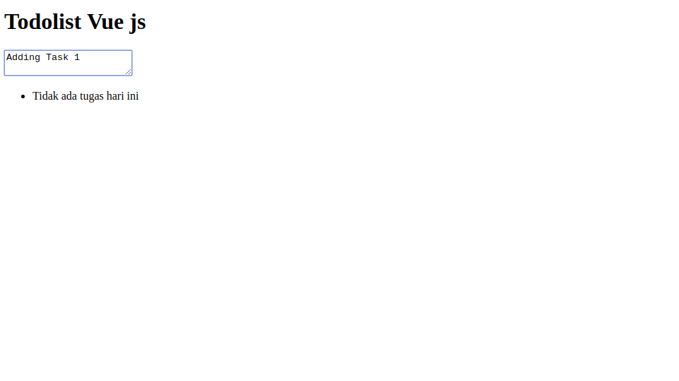
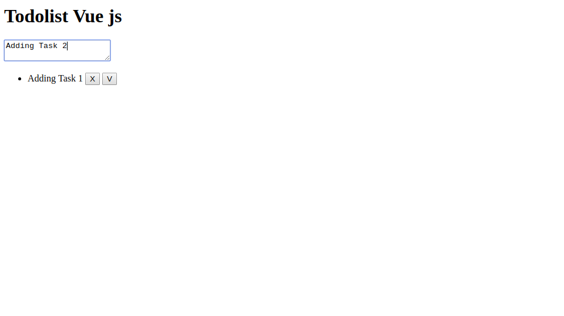
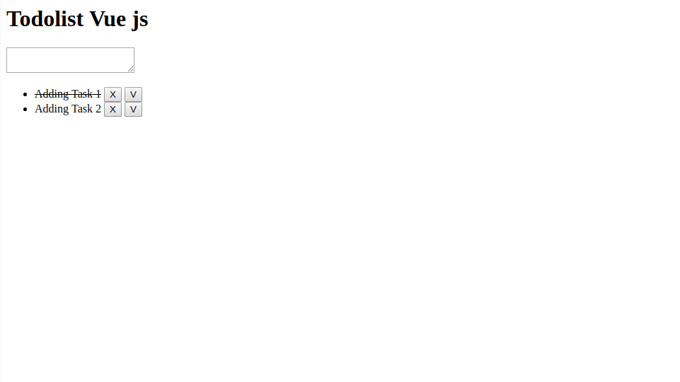

# Todolist Api menggunakan Vue js dan Axios

### Requirements
- PHP min ver.7.0

## Instalation
```
git clone https://github.com/linxcodev/vue-todolist-api.git
```

#### Masuk ke directory
```
cd vue-todolist-api
```

#### Masuk Database
- DB_name => todolist
- Table_name => todo

#### Rubah koneksi
```php
vim api/index.php || mysqli_connect()
```

## Enjoy running in your server
### Penampakan

### Menambah todo hanya dengan enter

### Hapus (x), Selesai task (v)


## Licence
MIT
